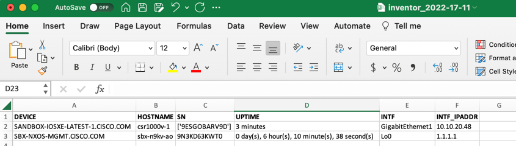

# INVENTOR | Get device information from Network devices
Get information from devices such: model, SN, interfaces, routing information etc. And save it into a CSV file.


## Pre-Requisites
You must have **Python3** and **pip3** installed. 
Once is done, clone this repository


## Install python dependencies
1. Open a CMD/Powershell/terminal console and move it folder `logs_from_cisco_sandbox``
2. Install the python dependencias that are in _requirements.txt_ file. You can use:
```
pip intall -r requirements.txt
````
## Running the script
1. Use the next command to run the script:
```
python inventory.py
```



